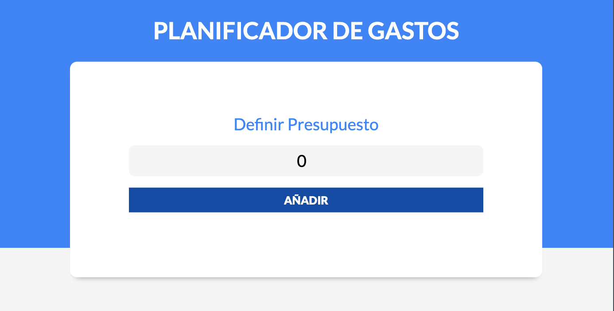
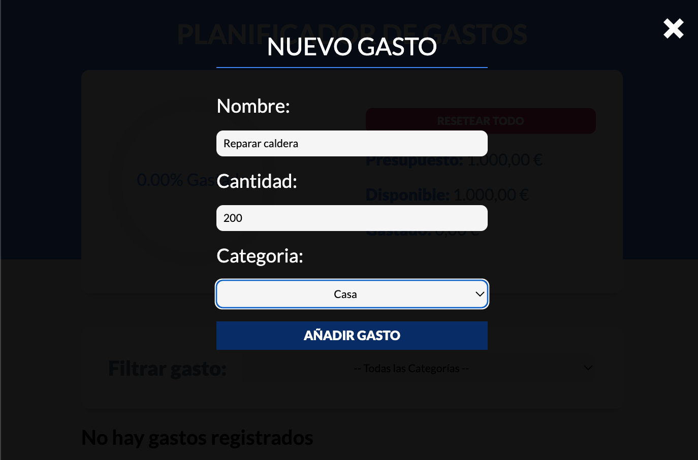
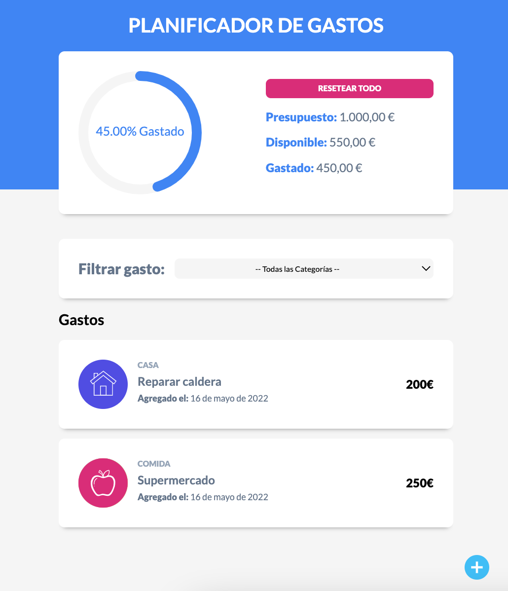
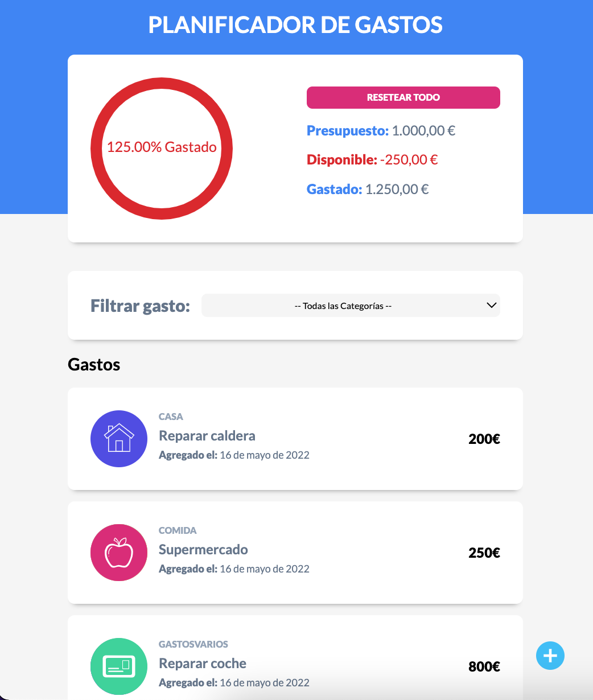

# ControlDeGastos

## vistas:

## Utilidad:

Con esta app web se puede hacer un control de los gastos mensuales.

- Se pone el presupuesto que uno tiene disponible ese mes.
- Se va añadiendo cada gasto que uno va haciendo.
- Se puede ver cuanto se ha gastado en cada categoria, en comida, en cosas del hogar, en salud, ocio, suscripciones...
- Visualmente podrás ver rapidamente si gastas más de lo que tienes como presupuesto y así evitar esta situación la proxima vez.
